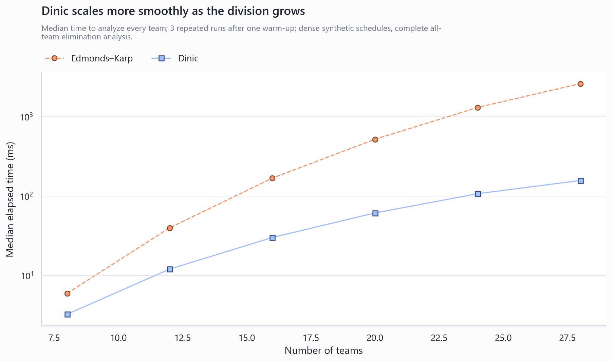
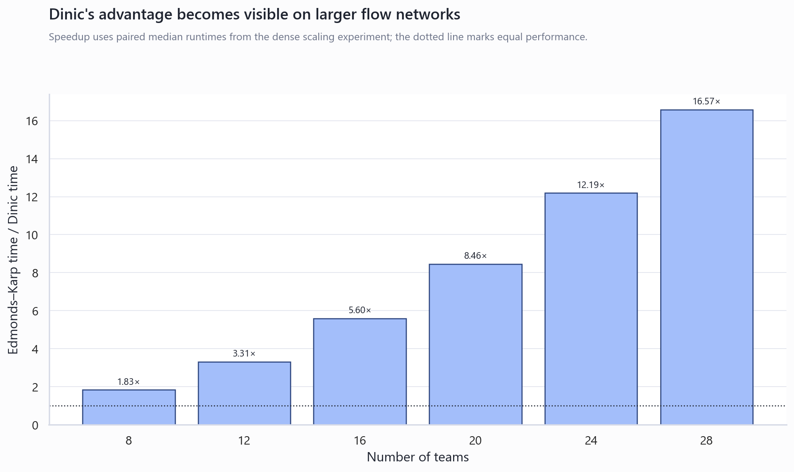
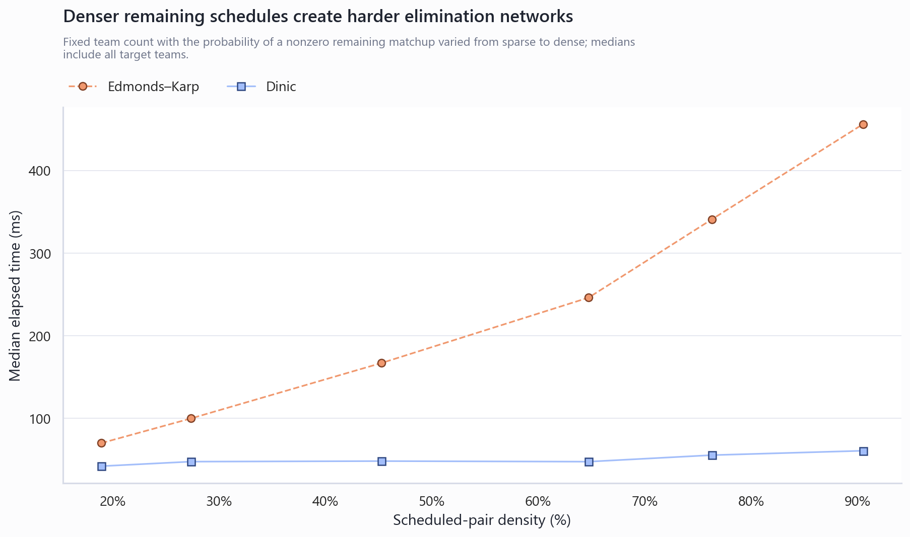
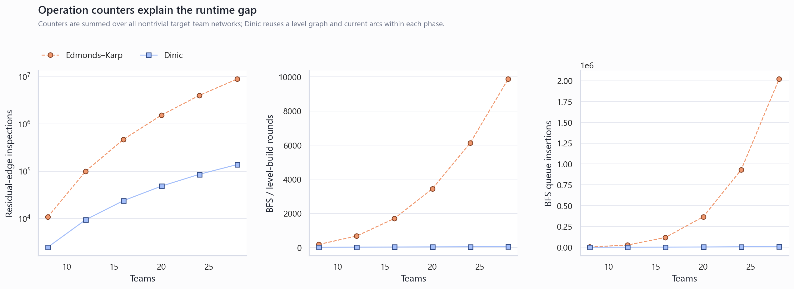
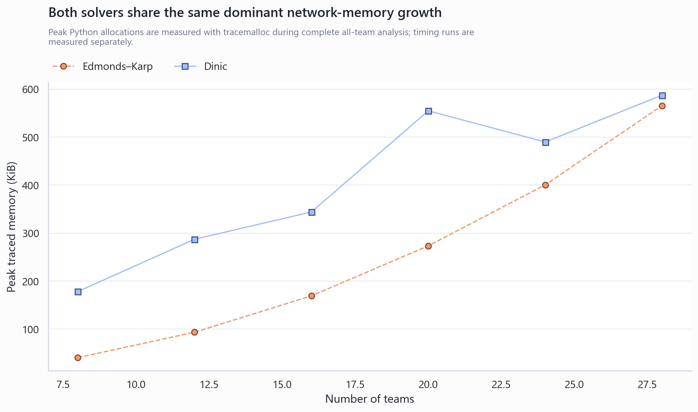
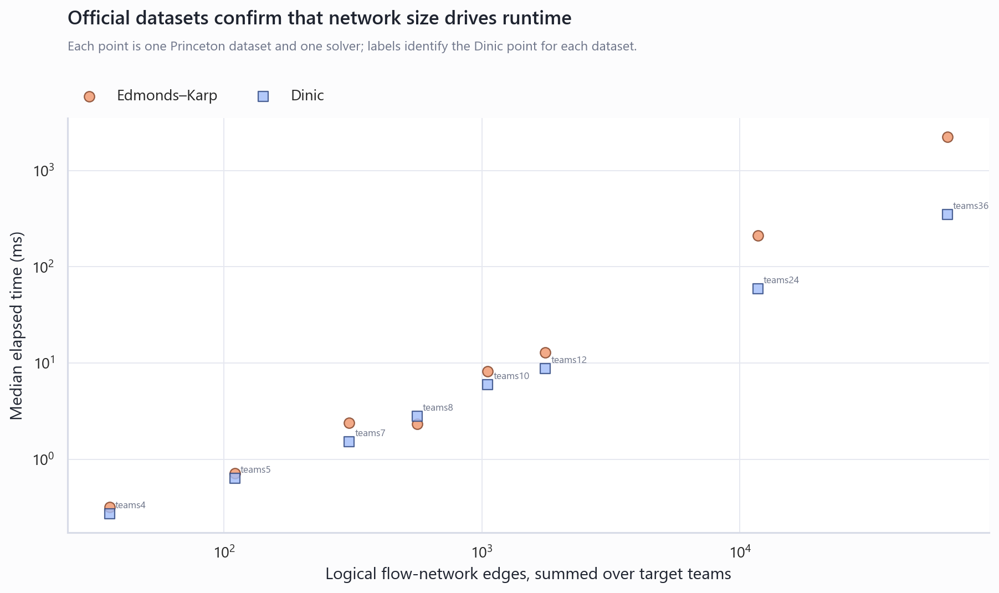

# 实验六：最大流应用问题——棒球淘汰问题

## 一、实验目的

1. 掌握最大流、残量网络和最小割的基本思想。
2. 学会把实际的赛程可行性问题转换为最大流问题。
3. 独立实现 Edmonds–Karp 基准算法和优化的 Dinic 算法。
4. 使用公开测试数据验证正确性，并通过多维实验比较两种算法的运行效率。
5. 设计浏览器可视化界面，逐步展示流网络、增广过程、残量更新和最小割证明。

## 二、问题描述

设分区内有 \(n\) 支球队。球队 \(i\) 已胜 \(w_i\) 场、已负 \(l_i\) 场、还剩 \(r_i\) 场比赛，球队 \(i\) 与球队 \(j\) 之间还要比赛 \(g_{ij}\) 场。

若无论剩余比赛如何安排，一支球队都不可能以第一名或并列第一名结束赛季，则称该球队已被数学淘汰。

本实验使用题目图片中的四队样例：

| 球队 | 胜 | 负 | 剩余 | Atlanta | Philadelphia | New York | Montreal |
|---|---:|---:|---:|---:|---:|---:|---:|
| Atlanta | 83 | 71 | 8 | 0 | 1 | 6 | 1 |
| Philadelphia（Philly） | 80 | 79 | 3 | 1 | 0 | 0 | 2 |
| New York | 78 | 78 | 6 | 6 | 0 | 0 | 0 |
| Montreal | 77 | 82 | 3 | 1 | 2 | 0 | 0 |

同时测试 [Princeton 官方 Baseball Elimination 数据](https://coursera.cs.princeton.edu/algs4/assignments/baseball/specification.php)。

## 三、流网络的构造

### 3.1 直接淘汰

判断目标球队 \(x\) 时，先假设它赢下自己的所有剩余比赛，则最大可能胜场为：

\[
M=w_x+r_x
\]

若存在另一支球队 \(i\) 满足：

\[
w_i>M
\]

则球队 \(x\) 已被直接淘汰，不必建立流网络。

例如 Montreal 最多得到 \(77+3=80\) 胜，而 Atlanta 已经有 83 胜，因此 Montreal 被直接淘汰。

### 3.2 非直接淘汰

若目标球队未被直接淘汰，建立以下网络：

1. 一个源点 \(s\)。
2. 对每一对不含目标球队的球队 \(i,j\)，建立比赛节点 \(G_{ij}\)。
3. 对每支非目标球队建立球队节点 \(T_i\)。
4. 一个汇点 \(t\)。

边及容量如下：

- \(s\rightarrow G_{ij}\)：容量为 \(g_{ij}\)，表示球队 \(i,j\) 之间尚未分配的比赛。
- \(G_{ij}\rightarrow T_i\) 和 \(G_{ij}\rightarrow T_j\)：容量取足够大的值，表示每场比赛的胜者只能是参赛双方之一。
- \(T_i\rightarrow t\)：容量为 \(M-w_i\)，限制球队 \(i\) 新增的胜场，使其最终胜场不超过目标球队的最大胜场 \(M\)。

源点出边容量总和为：

\[
G=\sum_{\substack{i<j\\i\ne x,j\ne x}}g_{ij}
\]

若最大流等于 \(G\)，说明所有剩余比赛都能分配，而且没有其他球队超过 \(M\)，目标球队仍可能并列第一；若最大流小于 \(G\)，说明至少有一部分比赛无法合法分配，目标球队被淘汰。

## 四、为什么最大流能解决该问题

### 4.1 可行赛程可以转换为流

若存在一种剩余比赛结果，使其他球队都不超过 \(M\) 胜，则对每场 \(i,j\) 间的比赛，把一个单位流量从比赛节点送向获胜球队节点。所有比赛都能分配，因此源点的比赛边全部满流；每支球队新增胜场不超过 \(M-w_i\)，所以球队到汇点的容量约束也满足。

### 4.2 满流可以转换为可行赛程

所有容量都是整数，最大流算法得到整数流。若源点所有比赛边满流，则比赛节点流向球队 \(i\) 的整数流量可解释为球队 \(i\) 赢得的场数。比赛节点只连接参赛双方，因此每场比赛都被正确分配；球队到汇点的容量又保证其最终胜场不超过 \(M\)。

因此：

\[
\text{存在可行赛程}\Longleftrightarrow \text{最大流}=G
\]

根据最大流最小割定理，若球队被淘汰，残量网络中从源点可达的球队节点构成淘汰证明集合 \(R\)。

## 五、最大流算法

### 5.1 Edmonds–Karp 基准算法

Edmonds–Karp 每次使用 BFS 寻找边数最少的增广路，然后按瓶颈容量增广，直到汇点不可达。

```text
max_flow = 0
while BFS 能找到 s 到 t 的增广路:
    bottleneck = 路径上的最小残量
    更新正向边与反向边
    max_flow += bottleneck
```

复杂度为：

\[
O(VE^2)
\]

优点是实现直观、结果稳定，适合作为基准；缺点是每次增广都需要重新 BFS，在稠密网络中增广次数很多。

### 5.2 Dinic 优化算法

Dinic 的优化包括：

1. BFS 建立分层图，只允许流从第 \(k\) 层流向第 \(k+1\) 层。
2. DFS 一次寻找多条增广路，形成阻塞流。
3. 当前弧数组记录每个节点已经检查到的边，避免重复扫描无效边。

```text
max_flow = 0
while BFS 能建立到达 t 的分层图:
    current_arc 全部置零
    while DFS 能在分层图中发送流:
        max_flow += pushed_flow
```

一般网络中的复杂度上界为：

\[
O(V^2E)
\]

虽然在本问题的一般复杂度表达中两种算法都可能达到较高阶，但 Dinic 能在一个分层阶段内同时处理大量比赛节点，实际性能明显更好。

### 5.3 棒球网络规模

对一支目标球队：

\[
V=\binom{n-1}{2}+(n-1)+2=O(n^2)
\]

逻辑边数为：

\[
E=3\binom{n-1}{2}+(n-1)=O(n^2)
\]

空间复杂度为 \(O(V+E)=O(n^2)\)。按 Edmonds–Karp 的 \(O(VE^2)\) 估计，判断一支球队为 \(O(n^6)\)，判断全部 \(n\) 支球队为 \(O(n^7)\)。

### 5.4 算法轨迹与可视化

为便于观察最大流的执行过程，程序在不改变算法结果的前提下加入可选事件记录器。Edmonds–Karp 记录 BFS 开始、发现节点、找到增广路、执行增广和结束事件；Dinic 记录建立分层图、DFS 进入、阻塞流推送和结束事件。

每个关键事件保存当前流量、路径或分层信息以及必要的残量网络快照。静态网页读取这些 JSON 轨迹后，将网络按“源点—比赛节点—球队节点—汇点”的自适应四层布局绘制，并提供播放、暂停、单步、时间轴、伪代码和算法状态标签页。较大网络会聚合暂时无关的比赛节点，避免节点过多造成画面不可读。

## 六、四支球队求解结果

两种算法输出完全一致：

| 球队 | 最大可能胜场 | 最大流/应分配场数 | 结论 | 淘汰证明 |
|---|---:|---:|---|---|
| Atlanta | 91 | 2/2 | 未淘汰 | — |
| Philadelphia | 83 | 6/7 | 淘汰 | Atlanta、New York |
| New York | 84 | 4/4 | 未淘汰 | — |
| Montreal | 80 | 0/0 | 直接淘汰 | Atlanta |

Philadelphia 的证明集合为 \(R=\{\text{Atlanta},\text{New York}\}\)。两队已经有：

\[
83+78=161
\]

胜，且互相之间还有 6 场比赛，因此最终总胜场至少为：

\[
161+6=167
\]

平均为 \(167/2=83.5\) 胜，所以至少有一队达到 84 胜，超过 Philadelphia 最多能取得的 83 胜。

## 七、Princeton 官方数据测试

下载包中共有 23 个文本数据文件，程序均能成功解析。对每个文件中的每支球队分别运行 Edmonds–Karp 和 Dinic，淘汰结论、最大流值和待分配比赛数全部一致。

| 数据文件 | 球队数 | 被淘汰球队数 |
|---|---:|---:|
| teams1.txt | 1 | 0 |
| teams4.txt | 4 | 2 |
| teams4a.txt | 4 | 2 |
| teams4b.txt | 4 | 3 |
| teams5.txt | 5 | 1 |
| teams5a.txt | 5 | 1 |
| teams5b.txt | 5 | 1 |
| teams5c.txt | 5 | 2 |
| teams7.txt | 7 | 2 |
| teams8.txt | 8 | 2 |
| teams10.txt | 10 | 1 |
| teams12-allgames.txt | 12 | 10 |
| teams12.txt | 12 | 4 |
| teams24.txt | 24 | 10 |
| teams29.txt | 29 | 17 |
| teams30.txt | 30 | 5 |
| teams32.txt | 32 | 9 |
| teams36.txt | 36 | 2 |
| teams42.txt | 42 | 8 |
| teams48.txt | 48 | 6 |
| teams50.txt | 50 | 0 |
| teams54.txt | 54 | 8 |
| teams60.txt | 60 | 18 |

### Japan 的淘汰证明

在 `teams12.txt` 中，Japan 最多取得 \(2+4=6\) 胜。程序给出的证明集合为：

\[
R=\{\text{Poland},\text{Russia},\text{Brazil},\text{Iran}\}
\]

四队当前胜场总数为：

\[
6+5+5+5=21
\]

四队内部还剩 4 场比赛，因此四队最终总胜场至少为 25，平均为：

\[
\frac{25}{4}=6.25
\]

所以至少有一队最终取得 7 胜，Japan 不可能以 6 胜并列第一。

## 八、性能实验

### 8.1 实验方法

- Python 版本：3.13.5。
- 每个样例先预热一次。
- 每种算法重复运行 3 次。
- 每次计时包含对该数据中全部球队的淘汰判定。
- 使用中位数降低偶然抖动。
- 规模实验使用 8、12、16、20、24、28 支球队的稠密赛程。
- 密度实验固定 20 支球队，改变存在剩余对局的球队对比例。
- 使用 `tracemalloc` 单独测量峰值 Python 内存，避免把内存测量开销混入计时结果。
- 统计残量边检查、BFS/分层轮数、DFS 调用、队列入队、增广和当前弧跳过次数。
- 随机数据使用固定种子，并生成对称、合法的赛程矩阵。
- 计时前先检查两种算法的结果完全一致。

### 8.2 随机稠密赛程结果

| 球队数 | Edmonds–Karp/ms | Dinic/ms | Dinic 加速比 |
|---:|---:|---:|---:|
| 8 | 5.977 | 3.258 | 1.83× |
| 12 | 39.894 | 12.062 | 3.31× |
| 16 | 168.706 | 30.145 | 5.60× |
| 20 | 519.702 | 61.466 | 8.46× |
| 24 | 1307.358 | 107.242 | 12.19× |
| 28 | 2606.793 | 157.318 | 16.57× |





### 8.3 赛程密度实验

固定 20 支球队后，实际非零对局密度从约 19% 提高到 91%。Edmonds–Karp 的中位耗时从约 70 ms 增长到 478 ms；Dinic 从约 45 ms 增长到 57 ms。密度增加会产生更多比赛节点有效边和可分配比赛，Edmonds–Karp 需要反复执行更多 BFS，因而对密度更敏感。



### 8.4 操作计数与内存

在 28 队稠密样例中，Edmonds–Karp 检查约 893 万条残量边，而 Dinic 约检查 13.9 万条。操作计数解释了二者的耗时差异：Dinic 在一个分层图内复用搜索结果，并使用当前弧避免重复检查已经失败的边。

两种算法使用相同的邻接表残量网络，峰值内存的主导因素均是 \(O(n^2)\) 的节点和边。Dinic 还维护分层数组和 DFS 状态，因此小中规模下峰值略高，但增长阶与 Edmonds–Karp 相同。





### 8.5 官方代表数据计时

| 数据集 | Edmonds–Karp/ms | Dinic/ms | Dinic 加速比 |
|---|---:|---:|---:|
| teams4 | 0.320 | 0.273 | 1.17× |
| teams12 | 12.890 | 8.824 | 1.46× |
| teams24 | 211.398 | 59.397 | 3.56× |
| teams36 | 2229.375 | 349.656 | 6.38× |



### 8.6 结果分析

小规模数据中，两种算法都很快，Dinic 的固定开销使优势还不明显。随着球队数增加，比赛节点和边数均按 \(O(n^2)\) 增长，Edmonds–Karp 需要重复执行大量 BFS；Dinic 可在同一分层图内发送阻塞流，并通过当前弧跳过无效边，因此增长速度明显更慢。

在 28 队随机稠密样例中，Dinic 比 Edmonds–Karp 快约 16.57 倍；在官方 `teams36` 数据中快约 6.38 倍。密度实验和操作计数进一步说明，Dinic 的优势来自显著减少重复边检查和 BFS 搜索，而不是牺牲正确性。实验说明 Dinic 更适合作为本问题的实际求解算法，Edmonds–Karp 则适合作为容易理解和验证的基准算法。

绝对耗时会受到处理器、Python 版本和后台负载影响，因此本实验重点比较同一环境下的相对趋势。

## 九、程序测试

自动化测试覆盖：

1. 残量边和反向边更新。
2. 已知最大流网络。
3. 随机网络中两种最大流算法的一致性。
4. 数据格式及异常输入。
5. `teams4`、`teams5` 官方预期结果。
6. 随机棒球赛程的一致性。
7. 命令行输出。
8. 安全下载和 ZIP 路径检查。
9. 算法事件轨迹与操作计数。
10. 可视化 JSON 导出和静态网页结构。
11. 扩展 CSV 字段和六张性能图。

执行命令：

```powershell
python -m pytest -q
```

性能实验命令：

```powershell
python scripts/benchmark.py --repeats 3
```

## 十、实验总结

本实验的关键不是简单比较各队当前胜场，而是处理剩余比赛之间的耦合关系。比赛节点表示必须分配的胜场，球队到汇点的容量表示不能超过目标球队的胜场上限，因此最大流恰好描述了所有可能的赛季结局。

Edmonds–Karp 便于理解和验证；Dinic 通过分层图、阻塞流和当前弧显著减少重复搜索。在所有 Princeton 官方数据和随机数据中，两种算法结论一致，而 Dinic 在较大网络上取得明显性能优势，达到了实验要求。

此外，浏览器可视化把抽象的流量变化转化为可回放的网络状态，使实验不仅能给出最终淘汰结论，也能解释结论是怎样通过增广路、阻塞流和最小割得到的。
